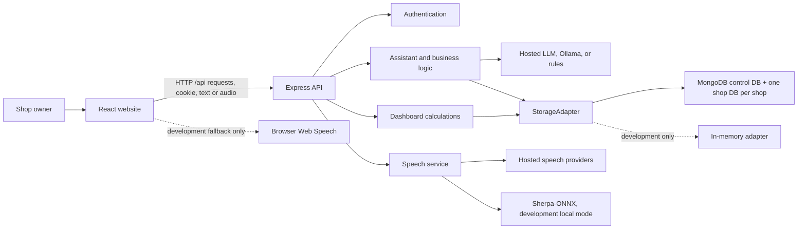

# Dukaandaar architecture

This guide explains how the website, API, Assistant, and storage fit together. It is written for contributors and operators; shop owners can start with the [README user guide](README.md#use-dukaandaar).

## At a glance

Dukaandaar has two applications. The React website collects user input and displays shop data. The Express API authenticates each request, applies shop business rules, calls an LLM or speech provider when configured, and reads or writes data through a storage interface.



The client and server are separate TypeScript projects with separate npm manifests. They do not share runtime code or TypeScript types. The API responses and the corresponding declarations in `client/src/types.ts` must therefore be kept in sync by hand.

## Applications and request path

### Website (`client/`)

- React owns the visible pages and temporary interface state. The Assistant is the first page after sign-in; other views include Overview, Transactions, Inventory, Reports, and Settings.
- `client/src/api/client.ts` sends requests with `credentials: "include"`, a JSON content type, and `X-Requested-With: Dukaandaar` on application requests.
- In development, Vite serves the website (normally port `5173`) and proxies relative `/api` requests to the API (normally port `4000`). The browser still uses a same-origin URL.
- If the website and API are deployed separately, set `VITE_API_BASE_URL` before building the website and set `CLIENT_ORIGIN` on the API. Use HTTPS and keep both on the same site for the `SameSite=Lax` session cookie.
- The selected Assistant language and chat messages live in page state. An opaque conversation-session ID is kept in per-tab `sessionStorage`; no authentication token is stored in browser storage.

### API (`server/`)

`server/src/index.ts` creates the Express app, validates the runtime environment, connects storage, and registers API routes. For a normal authenticated request, the main path is:

1. The request passes CORS handling, JSON/audio parsing, logging, and a write-request header check.
2. The API reads the session cookie, hashes its token, and asks `AuthService` to find the corresponding live session and user.
3. The authenticated user's `shopId` is attached to the request as the principal. Business routes take the shop ID from this principal—not from a shop ID supplied in a browser request.
4. A route calls the business, analytics, speech, or storage service.
5. The API returns JSON, an audio response, or an error with an HTTP status.

`GET /api/health` is public. Signup, login, current-user, and logout routes are handled before the general authentication middleware. Other business and speech routes require a valid session. State-changing API requests, including signup and login, also need the expected `X-Requested-With` header. The client API helper adds it automatically.

## Main API surface

All routes below use the `/api` prefix. Except for health and the `/api/auth/*` routes, endpoints require a signed-in session.

| Method and path | Purpose |
| --- | --- |
| `GET /api/health` | Public health, storage-driver, and runtime-environment status. |
| `POST /api/auth/signup` | Creates an account, a fresh shop ID/settings record, and a session. |
| `POST /api/auth/login` | Verifies email/password and issues a session cookie. |
| `GET /api/auth/me` | Restores the signed-in user in the website. |
| `POST /api/auth/logout` | Revokes the presented session and clears its cookie. |
| `GET /api/dashboard` | Returns shop settings, KPIs, seven daily points, products, low-stock items, and recent activity. |
| `GET /api/products` | Returns the product/inventory view used by the client. |
| `PUT /api/products/:id` | Edits allowed product fields and the stock-alert threshold, not stock-on-hand. |
| `GET /api/transactions` | Returns sales, purchases, expenses, and losses from the most recent 90 days. |
| `GET /api/settings`, `PUT /api/settings` | Reads or updates the current shop profile and default alert threshold. |
| `POST /api/parse` | Parses a text or voice transcript. Returns an answer, a clarification, or a pending action preview. |
| `POST /api/confirm`, `POST /api/cancel` | Commits or discards an Assistant action awaiting confirmation. |
| `POST /api/manual/:kind` | Validates and records a sale, purchase, expense, loss, or product from a form. |
| `POST /api/conversation/reset` | Clears the selected session's volatile Assistant context. |
| `GET /api/speech/status` | Reports configured speech availability without returning provider secrets. |
| `POST /api/speech/transcribe` | Accepts a mono, 16 kHz, 16-bit PCM WAV recording and returns text. |
| `POST /api/speech/synthesize` | Accepts text/language and returns generated audio. |

The API validates request bodies with Zod in the route or business layer. There are no API routes for deleting products or editing old ledger entries. Current stock is changed by ledger operations, not by an inventory form edit.

## Identity, sessions, and shop scoping

### Account creation and login

`AuthService` normalizes email to lowercase and creates a random user ID and a separate random shop ID for every signup. It stores a salted scrypt password hash. A login session uses a random token; only the token's SHA-256 hash is stored in MongoDB. The browser receives the original token in an `HttpOnly`, `SameSite=Lax` cookie scoped to `/api`; production cookies also have `Secure`. Sessions expire after 30 days, and logout revokes the session.

User and session records live in the shared control database. The public auth response does not expose the internal `shopId`. When a request is authenticated, the API resolves the user's internal shop ID and passes it to the rest of the application.

### Tenant boundary

A **tenant** is one shop. The API applies two boundaries to shop data:

1. It selects the shop database from the authenticated principal's `shopId`.
2. Shop documents and queries also carry/filter on `shopId`.

This means the database itself is different per shop, while the document-level ID is an additional consistency and safety check. See [Shop databases and data operations](#shop-databases-and-data-operations) for database naming and migration details.

### Request protection

- The session cookie is `HttpOnly`; browser JavaScript cannot read the authentication token.
- Non-read API requests require the custom `X-Requested-With` header. Credentialed CORS is restricted to configured origins in production.
- Signup and login request bodies are schema-validated. Passwords are not returned from the API.
- Provider API keys are read by the server from environment variables; they are not sent to the website or returned by speech status.

This is a small first-party session flow, not a full identity platform. Email verification, password reset, multi-user roles, and OAuth are not implemented.

## Storage and data model

The `StorageAdapter` interface defines the operations used by the services. `MongoAdapter` is persistent and used by default. `InMemoryAdapter` is an explicit development option for quick, disposable testing; it loses users, sessions, and shop data when the API process exits.

### Control database

`MONGODB_DB` is the shared control database. It contains:

- `users`: email, salted password hash, owner details, user ID, and the user's `shopId`.
- `sessions`: user ID, hashed session token, creation time, and expiry. MongoDB indexes support unique email/token hashes and session expiry cleanup.

Older shared-database shop documents may also remain here until an administrator explicitly migrates an eligible registered shop. The legacy/demo `SHOP_ID` fixture is deliberately not claimed or migrated.

### One business database per shop

The database name is:

```text
<MONGODB_SHOP_DB_PREFIX><shop_id>
```

The default prefix is `dukaandaar_`, so an ID such as `shop_abcd...` becomes a name such as `dukaandaar_shop_abcd...`. The control database and shop databases use the same MongoDB deployment/cluster, but are separate MongoDB databases. Keep the prefix and the shop ID stable: the name is how the adapter finds that shop's records.

Each tenant database contains these collections:

| Collection | What it stores |
| --- | --- |
| `settings` | Shop name, owner/contact details, currency/language, and default stock-alert threshold. |
| `products` | Catalog name, English search aliases, category, unit, sell/cost prices, and timestamps. |
| `inventory` | One record per catalog product: quantity on hand, low-stock threshold, and restock timestamps. |
| `sales` | Sales and item-level quantities, sell prices, recorded unit costs, and payment method. |
| `purchases` | Restocks, suppliers, quantities, unit costs, and purchase totals. |
| `expenses` | Operating-expense category, amount, note, and source. |
| `losses` | Lost/damaged quantity, reason, unit cost, and total loss value. |

Ledger items retain the product name and relevant price/cost used at the time of the transaction, so later catalog edits do not rewrite history. Chat/voice ledger entries may also retain the original `rawTranscript`; manual entries do not have one.

The adapter creates tenant indexes when it first accesses a shop database. It still includes `shopId` in tenant documents and filters reads/writes by it. The `MONGODB_SHOP_DB_PREFIX` validation leaves room for generated shop IDs within MongoDB's database-name limit.

## Shop databases and data operations

### New accounts

A signup receives a new shop ID. The account and its initial shop settings are stored separately: the account goes in `MONGODB_DB`, and the settings/business records go in that account's tenant database. A new account starts with an empty catalog and ledger. The API does not seed demo records at startup.

### Explicit demo seeding

Run from `server/`:

```bash
npm run seed -- --shop-id <shop_id>
```

The parser requires exactly one safe shop ID; it does not use `SHOP_ID` as a fallback. The command requires persistent MongoDB. It deletes and replaces only documents tagged with that ID in the corresponding tenant collections, then inserts the demo fixture. Treat it as destructive for the selected shop. For a registered account, find the value in `users.shopId` in the control database.

### Moving old account data

The explicit migration command is:

```bash
npm run migrate:shop -- --shop-id <shop_id>
```

It requires an account registered with that shop ID and refuses the configured legacy `SHOP_ID` as well as `shop_001`. It copies old shared-database records to the tenant database, verifies destination records, and only then deletes that shop's old copies. Stop the API to prevent concurrent writes and take a backup first. Run it once per eligible shop before opening the updated app to users. The migration does not move control users or sessions and does not claim legacy fixture records.

### MongoDB transaction behavior

On connect, the adapter checks whether MongoDB reports a replica set or `mongos`. Where transactions are supported, multi-document operations use MongoDB sessions/transactions. On a standalone server, writes instead use guarded updates and compensating rollback (for example, undoing stock adjustments if the matching ledger insert fails). This removes the replica-set-only transaction error for ordinary writes, but compensation cannot guarantee full atomicity if MongoDB or the API process stops in the middle. Use a replica set or `mongos` when full multi-document transaction guarantees are required.

## Inventory, ledger, and profit rules

Inventory and transaction history are deliberately linked:

- **Sale:** validate that enough stock exists, reduce stock, and write the sale record. Each sale item stores its sell price and cost basis.
- **Purchase/restock:** increase stock and write a purchase record. Purchases are inventory additions, not immediate expenses in the profit calculation.
- **Loss:** validate stock, reduce it, and record the lost quantity and its cost value.
- **Expense:** record the amount and category. It does not change stock.
- **New product:** quantity zero creates catalog and inventory records only. A positive opening quantity creates the product, initial inventory, and a purchase-history record at the purchase cost.
- **Product edit:** name, aliases, category, unit, prices, and stock-alert threshold may change. The current on-hand quantity is not editable through the UI or Assistant.

The main profit calculation is:

```text
profit = sale revenue
       - cost of goods sold
       - recorded expenses
       - recorded stock losses at cost
```

For each sale line, cost of goods sold is quantity multiplied by the line's recorded unit cost. Loss value is recorded as quantity multiplied by cost at the time of the loss. Purchases are not deducted again as an expense. Inventory value is a separate estimate: on-hand quantity multiplied by the product's current cost price.

Dashboard day boundaries and period filters use `Asia/Kolkata`. Weeks run Monday through Sunday. The dashboard and Assistant calculate totals in server code from stored transactions; the LLM does not invent or calculate financial figures.

## Assistant: from a message to an answer or saved transaction

The Assistant is a classifier and workflow helper, not the source of financial truth.

### A. Read-only question

1. The browser sends the transcript, selected language, source (`text` or `voice`), and its opaque conversation-session ID to `POST /api/parse`.
2. The selected parser returns a structured intent such as `QUERY_SALES`, `QUERY_PURCHASES`, `QUERY_LOSSES`, `QUERY_HISTORY`, or `QUERY_PROFIT`.
3. The server validates the intent, resolves any product name against the shop's catalog/aliases, and queries only that shop's storage.
4. Server code totals and formats the answer in the selected language. The LLM is not asked to calculate or supply the records.

### B. Request that changes shop data

```mermaid
sequenceDiagram
  participant Owner as Shop owner
  participant UI as React Assistant
  participant API as Express API
  participant Logic as BusinessLogic
  participant Store as Shop database

  Owner->>UI: Ask to record a sale, purchase, expense, loss, or product
  UI->>API: POST /api/parse (session cookie + transcript)
  API->>Logic: Parse and prepare action for authenticated shop
  Logic-->>API: Preview + short-lived pending ID
  API-->>UI: Confirmation response; no business record saved yet
  UI-->>Owner: Speak and display a read-back; offer confirm, edit, or cancel
  Owner->>UI: Confirm with button or voice
  UI->>API: POST /api/confirm (pending ID)
  API->>Logic: Commit the pending action for this shop
  Logic->>Store: Validate/write ledger and stock changes
  Store-->>Logic: Saved record(s)
  Logic-->>API: Localized result
  API-->>UI: Saved response
  UI-->>Owner: Show result and refresh dashboard
```

The pending action is held in API-process memory and expires after five minutes. It is scoped to the `BusinessLogic` instance for the authenticated shop and is not written to MongoDB. A server restart clears it. The confirmation dialog can read the preview aloud and accepts the existing buttons or a spoken affirmative. A manual form follows a separate path: the server validates its submitted fields and records the transaction when the form is submitted.

When product references are not English, the selected LLM may translate them to a catalog-search phrase. The resolver compares that phrase to the canonical product name and English aliases; deterministic translation/alias rules are available as a fallback. Ambiguous or missing products are clarified instead of silently selecting an unrelated item.

## LLM and language design

`server/src/services/llmProvider.ts` selects one of three parse modes:

- `LLM_PROVIDER=rules`: use the deterministic rule parser directly.
- `LLM_PROVIDER=ollama`: call the configured local Ollama endpoint.
- `LLM_PROVIDER=hosted`: call the configured OpenAI-compatible chat-completions endpoint using a server-only API key.

When `ollama` or `hosted` is selected, the model is consulted for each Assistant parse request. The server normalizes the provider's response, parses it through `IntentSchema`, and falls back to the rules parser if the provider fails, times out, or returns invalid structured data. In production, the selected LLM must be hosted; the deterministic rules parser is still allowed as the explicit safety fallback.

The model is asked to return an intent and supported fields, not to perform a database write or answer from guessed totals. Queries are answered after the intent is parsed by reading the tenant database. Model-reported confidence is capped before it reaches the preview. Provider/fallback attribution is included in the parse response and displayed as Assistant debug text.

Supported conversation-language codes are `en`, `hi`, `bn`, `fr`, `es`, `pt`, `ar`, and `zh`. English is the UI default; a language can be selected in the Assistant. The chosen language guides replies and speech; deterministic text/script detection is also available when a language is not provided.

Conversation context is temporary:

- API memory is keyed by shop plus the browser's opaque session ID.
- It retains up to eight recent user turns, with a two-hour idle expiry; the LLM prompt uses only a shorter recent window.
- The user can clear context from the Assistant. Restarting the API clears all of it.
- Context and assistant messages are not persisted to MongoDB. A ledger entry created from text/voice can retain that action's `rawTranscript` as noted above.

`LLM_THINKING_MODE` defaults to `false`. Setting it to `true` toggles reasoning options for Ollama and OpenRouter; custom hosted endpoints retain their provider defaults.

### Privacy and retention

- For a hosted LLM parse, the API sends the current message, recent user-turn context, selected language, and relevant product names/aliases. Product-translation requests can also send the queried product phrase and a relevant catalog subset. The model is not sent the shop's transaction ledger to calculate totals; totals are fetched and computed by the API.
- The API currently writes incoming Assistant transcript text to its standard output logs. Hosting platforms may retain those logs, so production operators should restrict access and set appropriate retention.
- A confirmed text/voice transaction may store its original `rawTranscript` in the tenant ledger. Manual form entries do not have that field. Conversation context and the in-page chat display are not persisted as a chat-history collection.
- The API handles audio as a request payload. Local Sherpa STT temporarily writes a WAV file and removes its temporary directory after inference. In hosted speech mode, audio is sent to the configured STT provider; TTS text is sent to the configured TTS provider. In development, the browser Web Speech fallback may process audio through browser-managed services.
- Credentials belong only in server environment variables. Do not include keys in client-side `VITE_*` variables or commit real `.env` files.

## Speech pipeline

The user chooses one conversation language and presses the microphone. The browser records a long turn, displays a live microphone waveform, and stops when the user taps stop or after eight seconds of detected silence. Recognized text is appended to the existing composer text instead of replacing it. The server accepts mono, 16 kHz, 16-bit PCM WAV; the default upload cap is 64 MiB and the default duration cap is 30 minutes. These limits can be reduced or raised within configured bounds.

The selected speech mode comes from server environment variables; there is no provider-settings screen. The browser calls the API for server-side transcription/synthesis when those services are available.

| Runtime and `VOICE_MODE` | Speech-to-text | Text-to-speech / fallback |
| --- | --- | --- |
| Development + `local` | Sherpa-ONNX if compatible local assets are installed; otherwise browser Web Speech can be used. Cloud vendors are skipped, even if their keys are present. | Sherpa-ONNX Supertonic if installed; otherwise browser speech can be used. |
| Development + `hosted` | Configured providers in order (default ElevenLabs, then Deepgram); if they fail, the browser can fall back to Web Speech. Sherpa is skipped. | Configured cloud providers in order; if they fail, the browser can fall back to speech synthesis. Sherpa is skipped. |
| Production | Hosted STT providers only. Production startup requires at least one fully configured provider. | Hosted TTS providers only; production startup requires at least one fully configured provider. Browser and Sherpa fallbacks are disabled. |

Speech keys stay on the server. In hosted mode, recordings are sent to the configured STT vendor and read-back text is sent to the configured TTS vendor. The client-side Web Speech fallback in development is managed by the browser and may have its own provider/privacy behavior.

The local models are optional and not included in the repository:

- **STT:** compatible multilingual Sherpa-ONNX Whisper ONNX encoder, decoder, and tokens files; Whisper.cpp GGML `.bin` files cannot be used in their place.
- **TTS:** the Sherpa-ONNX Supertonic bundle, including `duration_predictor.int8.onnx`, `text_encoder.int8.onnx`, `vector_estimator.int8.onnx`, `vocoder.int8.onnx`, `tts.json`, `unicode_indexer.bin`, and `voice.bin`.

For Hindi STT, select **हिन्दी** in the Assistant; the UI sends `hi-IN` and the server converts that to Whisper's `hi` language code. Leave `SHERPA_ONNX_WHISPER_LANGUAGE` blank to follow the UI, set it to `hi` to force Hindi, or set it to `auto` to ask a compatible multilingual model to detect the language. `VOICE_STT_LANGUAGE` is only a hosted-provider override and does not override local Sherpa. Use a multilingual Whisper model, not an English-only `.en` model. Configure file paths and provider keys in `server/.env`. See [`server/.env.example`](server/.env.example), [`server/.env.production.example`](server/.env.production.example), and the [Sherpa-ONNX speech documentation](https://k2-fsa.github.io/sherpa/onnx/).

## Runtime configuration and deployment

The API validates `NODE_ENV` as `development`/`dev` or `production`/`prod` before it listens. Unknown values fail instead of silently choosing a mode.

| Setting | Development | Production |
| --- | --- | --- |
| `STORAGE_DRIVER` | `mongo` by default; `memory` is available but volatile. | Must be persistent `mongo`. |
| `MONGODB_URI` | May point to local MongoDB. | Must use a hosted MongoDB URI, not localhost. |
| `MONGODB_DB` and `MONGODB_SHOP_DB_PREFIX` | Defaults are available locally. | Required and validated; prefix must leave room for generated shop IDs. |
| `LLM_PROVIDER` | `rules`, `ollama`, or `hosted`. | Must be `hosted`; endpoint, model, and API key are required. |
| `VOICE_MODE` | `local` or `hosted`. | Must be `hosted`; at least one configured hosted STT and one TTS provider are required. |
| `CLIENT_ORIGIN` | Optional for local Vite use. | One or more exact HTTPS frontend origins are required. |

The production template lists the supported environment variables. A hosted voice chain may contain ElevenLabs and/or Deepgram; an unconfigured provider is skipped. ElevenLabs TTS additionally needs a voice ID. Provider keys and all production service settings stay on the API server. The web app's `VITE_API_BASE_URL` is public build-time configuration, not a secret.

For production, build the server and client separately. Run the API with `npm start` after `npm run build`; deploy the client's `client/dist/` files to a static web host. Configure the frontend origin and API origin consistently, use HTTPS, and keep the sites same-site for the cookie. Do not serve the Vite development server as the production website.

## Source map and change guide

```text
client/src/
  App.tsx                   Sign-in restoration, navigation, page composition, dashboard refresh
  api/client.ts             Browser-to-API requests and session-expiry handling
  components/               Assistant, forms, dashboard widgets, pages, auth views
  hooks/                    Browser/server speech recording and synthesis
  locales.ts                Website labels and Assistant-language choices
  types.ts                  Client-side API response/request types

server/src/
  index.ts                  Express middleware, auth, routes, startup/shutdown
  config/runtimeConfig.ts   Development/production validation
  services/
    authService.ts          Signup, scrypt password hashes, cookie-session lookup
    businessLogic.ts        Parse results, business rules, previews, confirmation, manual entries
    intentSchemas.ts        Zod intent schema and LLM prompt
    llmProvider.ts          Ollama/hosted calls, output normalization, fallback handling
    ruleParser.ts           Deterministic intent parser
    analyticsService.ts     Dashboard assembly and exact money/stock calculations
    conversationMemory.ts   Bounded, expiring process-local conversation context
    cloudSpeech.ts          Hosted STT/TTS providers and provider order
    offlineSpeech.ts        Sherpa-ONNX local inference and audio validation
    conversationLocale.ts   Supported languages and Assistant response phrases
  storage/
    StorageAdapter.ts       Contract used by business/analytics services
    MongoAdapter.ts         Control DB, tenant DB routing, indexes, writes, migrations
    InMemoryAdapter.ts      Isolated but volatile development storage
    tenantDatabase.ts       Shop-ID validation and tenant database naming
  scripts/
    seed.ts                 Explicit destructive `--shop-id` seed command
    migrateShop.ts           Explicit legacy-account data migration command
  types.ts                  Server-side domain and API data structures
  test/                     Node test-runner tests
```

Useful change paths:

- Add/edit an API endpoint in `server/src/index.ts`; validate its input and derive `shopId` from the authenticated principal.
- Change ledger or stock behavior in `BusinessLogic` and both adapters; update/add tests for both persistent and in-memory behavior where practical.
- Change Assistant intent fields in `intentSchemas.ts`, parser behavior in `ruleParser.ts`/`llmProvider.ts`, then test clarification, query, confirmation, and failure cases.
- Change profit/report calculations in `analyticsService.ts`, not in React or the LLM. Add a calculation test.
- Change user-facing website labels in `client/src/locales.ts`; Assistant responses use `server/src/services/conversationLocale.ts`.
- Keep `client/src/types.ts` aligned with `server/src/types.ts` and route response objects.

## Development checks

Run tests and builds from their respective project folders:

```bash
cd server
npm test
npm run build

cd ../client
npm run build
```

Tests use Node's built-in test runner through `tsx`. Mock/fake storage and stubbed provider responses let most checks run without production credentials. For real Mongo testing, use a disposable database; for migration or seeding, back up first and verify the supplied shop ID carefully.

## License

This project is distributed under the [MIT License](LICENSE).
